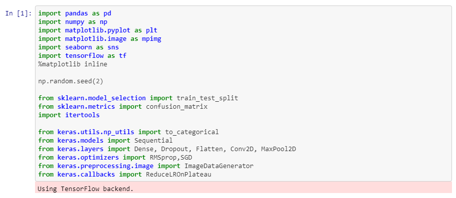
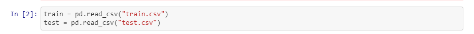
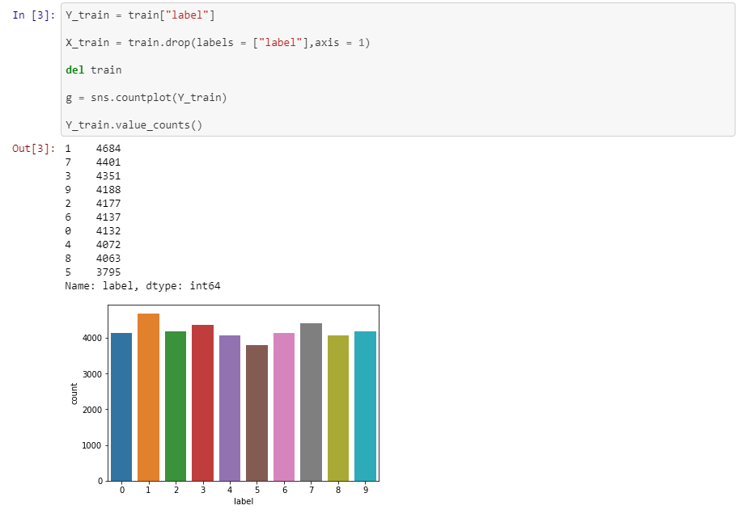
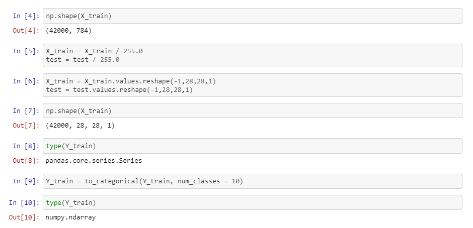
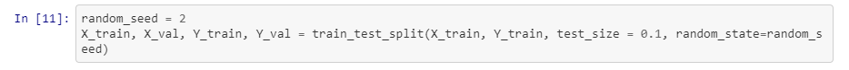
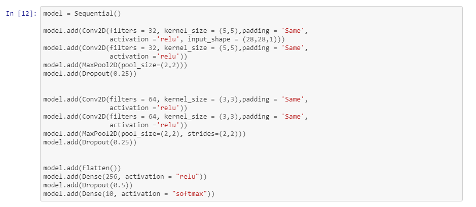
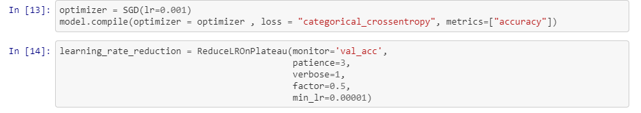
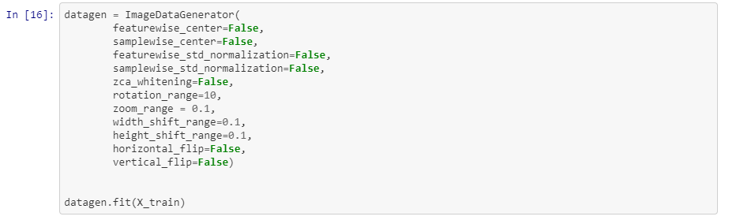
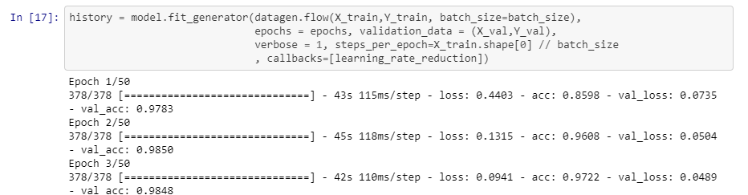
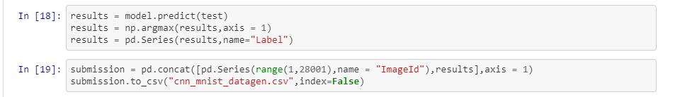

# Digit Recognition
**Digit recognition using keras model: 
training custom made model on MNIST dataset using keras 
**

**EXPLANATION** 
import required libraries

load our csv file

select label column in dataframe train as our Y_train which will be our labels. 
Drop that label column and seect everything else which will be out pixel values of each image. 
now to check if data is symmetrically distributed among all our labels that is 0-9 
we check it by printing them and there plot using **seaborn** library which we imported as sns

to preprocess the data normalise it by divinding it with 255 as 255 is max value a single pixel can have. 
see shape of single image is 1,784(28x28) as it is known,input to **Convolutional layer** is an image. 
reshape it to 28x28 so we can use **conv layer** as our 1st layer. 
our Y_train is numeric form. convert it to vector form by using **to_categorical.** 
eg. 3 --> (0,0,0,1,0,0,0,0,0,0)

split date into 2 parts to use 2nd part for validation I have used 0.9-0.1 split in out case. 
we do this to make sure our model is not **overfitting**. 

created a simple model. 
here in 1st line when we add **conv2D layer** --> 
we have to mension imput_size of each image in our 1st layer of our model.(28x28x1) 
our image is gray scaled so its **depth is 1** that is why there is 28x28x1 image not 28x28. 
if it was coloured it is usually represented with RGB that is of **depth 3**. 
**filters** mean depth of our layer after convolution. 
**kernel_size** is filter size that convolve over our image. 
**padding** is 0s we put to have image of size we want after convolution. 
it is good to use activation after every conv layer so we use **relu activation** as it is very less coputationally expensive. 
this ends our **convolutional layer**. 
**max pool layer** simpy chooses maximum from its filter nothing to explain. 
**dropout layer** is used to avoid overfitting. 
**flatten** converts the tensor like output from conv layers to a vector which can be used in **dense(simple neural net)** layer. 
our last layer have only 10 units as our output is a vecotor of (1x10). 
since it is last layer we can use better activation that is softmax

once our model is ready we compile it by choosing a **optimizer,loss function** if necessary choose a **learning rate reduction** method as well 

we can create more data by **data augementation** method which simpy changes images little bit 
solving our problem of having less data. :)  

train the model(by the way verbose means how you want to show your training process) 

predict the test case 
remember output would be 1x10 vector for each image convert it into 1x1 choosing index of max value among them 
save it in dataframe and create csv file. 

please share if this helped :)
